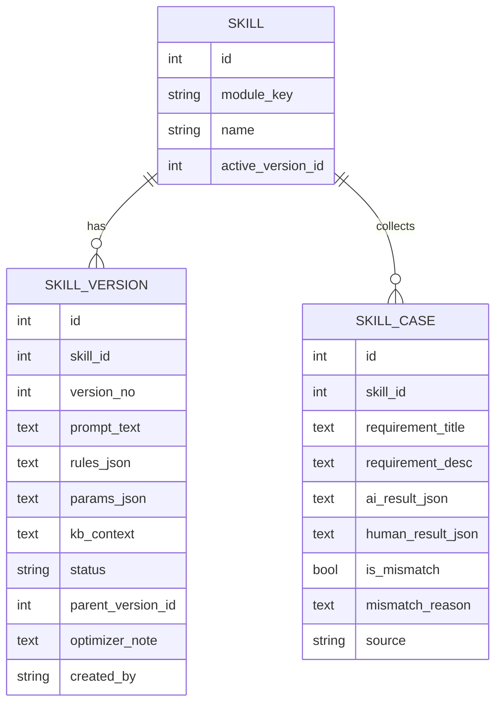

# 需求处理四模块 Skill 内化与自优化 — 详细技术方案

> 目标：把"需求可靠性打分 / 重复需求识别 / 需求分类 / PRD 分析"四个流程**内化**为 4 个可在「系统管理」中人工配置与修改的 Skill；并提供案例库与"一键优化"能力——人工定期把"AI 分类与实际人工分类不准的例子"加入案例库，点击优化后由 LLM 基于这些例子改进对应 Skill，并经过评测 + 人工审核后生效，从而持续提升系统准确度。

---

## 1. 目标与范围

- **必须做**：4 个 Skill 的可视化编辑、版本管理；案例库（误判样本）的录入与消费；基于案例库的 Skill 优化；优化前后的评测对比；人工审核与一键回滚。
- **关键原则（决定"是否更准确"）**：
  1. 外置**结构化规则**（尤其分类的 `CATEGORY_TREE / TERM_MAPPING / CROSS_MODULE_RULES`），而不只是散文 prompt——结构化规则是 LLM 实际消费的输入，对准确率杠杆最大。
  2. 推理时把案例库误判样本以 **few-shot** 方式注入（最快见效、且安全）。
  3. **度量先行**：案例库同时是评测集，优化前后都跑一遍对比准确率，且必须人工审核 + 可回滚。
- **不做**：不动 `quality_rules.py` 的确定性预检（它属于代码级硬规则，不应被优化器改写）。

## 2. 总体架构（闭环）

```
[生效 Skill(版本化)] ──调用──> [4 模块推理]
        ↑ (采纳/回滚)            │
        │                       ↓
[草稿 Skill(优化器产出)] <── [优化器 LLM] <── [案例库(误判样本)]
        ↑ (评测对比)            │            ↑
        └──────────── [评测引擎] ┘            │
                               人工复核&误判标注 ┘
```
- 主链路（图右侧）：推理 → 人工标注误判 → 沉淀案例库 → 优化器产出草稿 → 评测 + 人工审核 → 采纳为生效 Skill。
- 旁路（图左侧橙色）：案例库以 few-shot 直接注入推理，不改 prompt 也能即时提升。

## 3. 数据模型

### 3.1 ER 图



### 3.2 字段说明（新增于 `backend/app/database.py`）

- **`skills`**：`id, module_key(UNIQUE: reliability|duplicate|classification|prd), name, description, active_version_id, created_at, updated_at`
- **`skill_versions`**：
  - `prompt_text`：主提示词散文（模块原 prompt 模板外置后的可编辑文本，含 `{placeholder}`）。
  - `rules_json`：结构化规则。分类模块存 `{category_tree, term_mapping, cross_module_rules}`；重复模块存 `{similarity_threshold}`；打分/PRD 存权重与阈值等。
  - `params_json`：可调参数（如 `reliability_threshold, prd_weight_coverage...`），与现有 `user_settings.PERSONAL_FIELDS` 中"模型相关"项对齐。
  - `kb_context`：注入的知识背景（可空，默认复用 `knowledge_base.get_*_context()`）。
  - `status`：`draft | active | archived`。
  - `parent_version_id, optimizer_note, created_by`：血缘与审计。
- **`skill_cases`**：`requirement_title/desc, ai_result_json, human_result_json, is_mismatch, mismatch_reason, source(manual|auto), created_by, created_at`。

迁移：在 `_migrate_add_columns` 同款机制里 `CREATE TABLE IF NOT EXISTS` 三张表，并初始化 4 个 Skill 的**首个 active 版本**——内容直接来自现有代码常量（保证上线即"行为不变"）。

## 4. 后端 Skill 存储与运行时接线

新增 `backend/app/skill_store.py`：

- `get_active_skill(module_key, db=None) -> dict`：返回 `{prompt_text, rules_json, params_json, kb_context}`，带进程内缓存（TTL ~60s）+ 版本变更即失效。
- `list_skills(db)`, `get_versions(skill_id, db)`, `create_version(...)`, `activate_version(skill_id, version_id, db)`：供 API 与优化器复用。
- `build_fewshot_examples(skill_id, k=3, db=None) -> str`：取 `is_mismatch` 案例，按模块格式化成 few-shot 文本（截断长度，防 prompt 膨胀）。

各模块改造点（**只改"读取来源"，不改业务逻辑**）：

| 模块 | 当前读取 | 改为 |
|---|---|---|
| 可靠性打分 | `prompts.get_reliability_prompt` 读 `get_active_setting` + `knowledge_base.get_reliability_context` | 新 `render_reliability_prompt(skill, title, desc, precheck)`，参数来自 `skill.params_json` |
| 重复识别 | `prompts.DUPLICATE_DETECTION_PROMPT` + `get_duplicate_prompt` | 相似度阈值从 prompt 文案提取为 `skill.params_json.similarity_threshold`；渲染时注入 |
| 需求分类 | `classifier._classify_with_llm` 内联 prompt + `classification_kb.build_*_text()` | `build_*_text(data=skill.rules_json)` 接受注入；system prompt 文案取自 `skill.prompt_text` |
| PRD 分析 | `prompts.get_prd_prompt` 读权重/松紧度/`pass_threshold` | 改为读 `skill.params_json`（权重/阈值/松紧度三选一）；评分标准文案按松紧度在 `rules_json` 或代码常量中取 |

> 注意：`quality_rules.py` 的确定性预检保持代码逻辑不变，仅作为 `precheck` 文本注入 prompt。

## 5. 案例库：录入与消费

- **录入入口**（前端各模块页"加入案例库"按钮）：
  - 自动带出 `requirement_title/desc` 与当前 `ai_result_json`；
  - 人工填写 `human_result_json`（正确分类/分数/是否重复/PRD 是否合格）+ `mismatch_reason`；
  - `is_mismatch` 默认 true（用户场景就是"不准的例子"），可改 false 作为"正确样本"。
- **消费**：
  - 优化器：取 `is_mismatch` 样本作为改进依据（限最近 N 条 / 可全量）。
  - few-shot：同上，格式化后注入推理 prompt。
  - 评测：全部（含正确样本）作为评测集。

## 6. 优化引擎

### 6.1 触发与输入
`POST /api/skills/{module_key}/optimize` → 拉取当前 active 版本 + 误判案例（默认最近 20~50 条，可配置）→ 调 LLM。

### 6.2 优化器提示词与输出 schema
- 系统角色："你是需求处理 Skill 的优化专家。根据下列误判案例，修订该模块的提示词与结构化规则，使模型在同类案例上给出与人工一致的结果。**只输出 JSON**。"
- 输入拼接：当前 `prompt_text` + `rules_json` + `params_json` + 案例集（每条含 需求 / AI结果 / 人工正确结果 / 误判原因）。
- **强制输出 schema**：
  ```json
  {
    "prompt_text": "修订后的提示词（保留 {placeholder}）",
    "rules_json": { "...": "修订后的结构化规则" },
    "params_json": { "...": "修订后的参数" },
    "changes": ["改动点1", "改动点2"],
    "rationale": "为什么这样改能减少误判"
  }
  ```
- 对**分类模块**额外约束：新增的 `category_l1` 必须落在既有树内，或单独在 `changes` 中显式"建议新增分类 X（待人工确认）"——禁止优化器静默引入非法分类。

### 6.3 校验与落库
后端解析后做：JSON 合法、必填字段齐全、`rules_json.category_tree` 键集合 ⊆ 既有 L1（否则拒绝并提示）、长度上限（prompt ≤ 8000 字符、rules ≤ 目标上限）。通过后存为 `status=draft` 的 `skill_versions`，返回 `version_id` + `optimizer_note`。

## 7. 评测引擎

- `POST /api/skills/{module_key}/evaluate`（`body: {draft_version_id}`）：以 `temperature=0` 在 `skill_cases` 上分别跑"active 版本"与"指定 draft 版本"，逐条比对模型输出与 `human_result_json`。
- **指标**：
  - 分类：`accuracy` + 各级混淆（尤其误判集中的 L1/L2）；
  - 重复：`is_duplicate` 一致率 + similarity 误差；
  - 打分：`pass(≥阈值)` 一致率；
  - PRD：`completeness_score≥pass_threshold` 一致率。
- 返回：`{active_accuracy, draft_accuracy, delta, per_case: [...]}`，前端在"草稿审核"页展示前后对比，作为人工采纳的核心依据。

## 8. API 设计（`backend/app/routers/skills.py`，注册到 `app`）

| Method | Path | 说明 |
|---|---|---|
| GET | `/api/skills` | 列出 4 个 Skill + 生效版本摘要 |
| GET | `/api/skills/{module_key}` | 详情（含 active 版本全文） |
| GET | `/api/skills/{module_key}/versions` | 版本历史 |
| POST | `/api/skills/{module_key}/versions` | 人工创建草稿（编辑 prompt/rules/params） |
| POST | `/api/skills/{module_key}/versions/{vid}/activate` | 设为生效（同时失效旧 active） |
| GET | `/api/skills/{module_key}/cases` | 案例列表（filter: is_mismatch / page） |
| POST | `/api/skills/{module_key}/cases` | 新增案例（模块页按钮调用） |
| DELETE | `/api/skills/{module_key}/cases/{cid}` | 删除案例 |
| POST | `/api/skills/{module_key}/optimize` | 运行优化器 → 生成草稿版本 |
| POST | `/api/skills/{module_key}/evaluate` | 评测 active vs 草稿，返回对比 |

权限：仅管理员（参考现有 `用户管理` 权限模型）。

## 9. 前端改造点

- **系统管理 → 模块技能**（新增菜单项，置于「用户管理/审计日志」同级）：
  - 4 张 Skill 卡片；点击进入 `SkillEditor`：标签页「当前生效 / 版本历史 / 草稿审核」。
  - 编辑器：prompt 用多行文本框；`rules_json/params_json` 用 JSON 文本框 + 前端校验；「基于案例库优化」按钮 → 调 `/optimize` → 展示 diff（旧 vs 新）+「评测」结果 → 采纳/驳回。
- **案例库页**（独立页或嵌入模块技能下）：表格（模块筛选、是否误判筛选）、增删改查、详情对比（AI vs 人工）。
- **各模块页**：在需求结果行加「加入案例库」按钮 → 弹窗预填标题/描述/AI 结果，填人工正确结果 + 误判原因。

## 10. 分阶段实施计划

| 阶段 | 内容 | 行为是否变化 | 估时 |
|---|---|---|---|
| **Phase 0** | 建 `skill_cases` + 评测脚本，在现有误判样本上跑当前 Skill 得**准确率基线** | 否 | 1d |
| **Phase 1** | `skills/skill_versions` 表 + 初始化 4 个 active 版本（内容=现有常量）；`skill_store` + 四模块改读来源 | 否（来源切换） | 2d |
| **Phase 2** | 案例库录入 + few-shot 注入 | 是（精度提升） | 1d |
| **Phase 3** | 优化器 + 评测 API + 草稿审核/采纳/回滚 + 前端技能页 | 是 | 3d |
| **Phase 4** | 周期化工作流（定期复盘、回滚、A/B） | — | 持续 |

> Phase 0 必须最先做：没有基线，"优化"无法判断是否更准。

## 11. 风险与对策

- **提示词膨胀/超时**：few-shot 限条数、KB 精简、结果缓存；`prompt_text` 设长度上限。
- **过拟合少量案例**：评测集与优化案例分离、设最小案例数、必须人工审核。
- **优化器改坏分类树**：校验 `category_l1` 合法性，非法直接拒绝并提示。
- **回归**：优化前/后强制跑评测，一键回滚到上一 active 版本。
- **案例内容注入攻击**：案例文本作为 data 转义，绝不作为指令执行。
- **LLM 非确定性**：评测统一 `temperature=0`。

## 12. 验收标准

1. 4 个 Skill 可在系统管理编辑并存为版本；重启后端后生效版本从 DB 读取。
2. 任一模块页可一键把"AI≠人工"样本加入案例库。
3. 点击「基于案例库优化」生成草稿版本，且必须**先评测**展示"优化前→优化后准确率"才允许采纳。
4. 采纳即生效、驳回即丢弃；任何版本可一键回滚。
5. 上线后整体准确率相对 Phase 0 基线**可见提升**（以评测集为准）。
